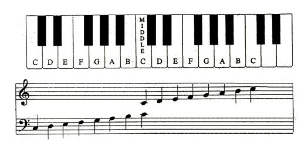
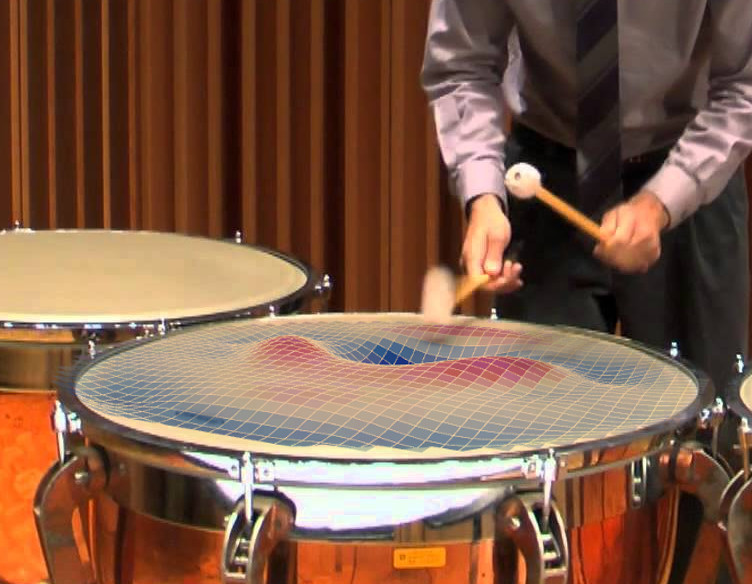

### Office hours

I've decided to hold office hours:

* Wednesday: 4:30-6:30
* Thursday: 3:00-5:00

### Resources for today:

Here's a piano keyboard for reference:

Here's a <a href="https://www.onlinepianist.com/virtual-piano">virtual piano</a> you can play on your computer/tablet.

### Today we will:

* Talk about HW1 submissions
* Talk about how we measure loudness
* Talk about musical intervals and get you started on HW2
* Discuss where the harmonic series/overtones that we observe comes from in the first place (if we have time)

### After class today you should:

* Start on HW2. 
* Make plans to come to office hours if you want extra help with music-reading and piano-playing (for the nonmusicians),
or if anything today wasn't clear
* **Work on Homework 1**
* Read pages 47-66 -- a look forward to what we will do next week.

* **Homework 2 is due February 12**

### Next week we will:

* Start our study of stringed instruments, with a presentation by Aaron on guitars (and a sidenote about ears)

