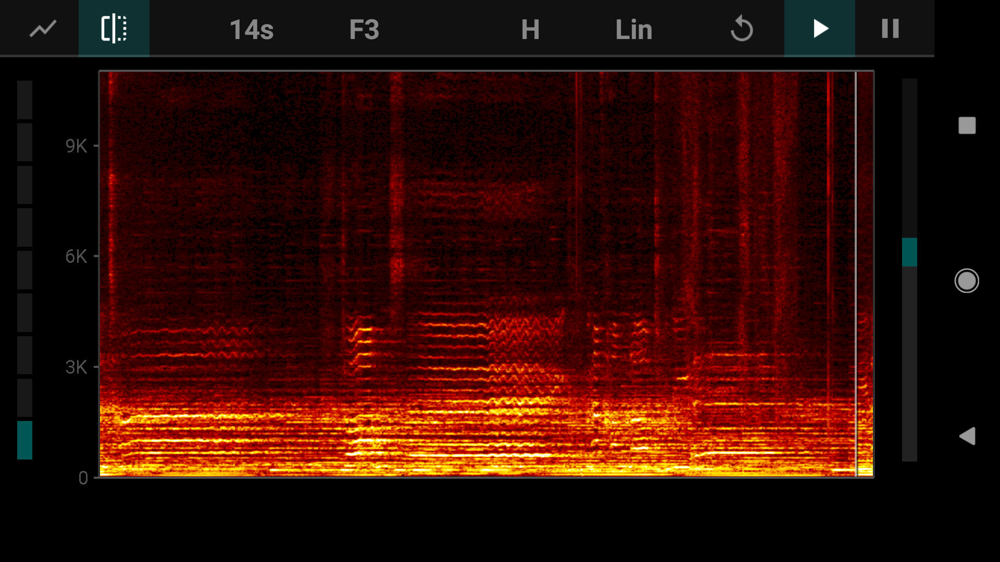

## Spectroscopy

#### Due 11:50 PM, Saturday, January 27, by email to wafreema@syr.edu. The title of your email should be "(Your Name), PoM Homework 1"

*You may make the recordings/spectrograms for this homework assignment in groups of up to three, as long as everyone is present when the recordings are made. Everyone must submit their own results and discussion, but you
are encouraged to collaborate on the discussion of spectroscopic features. List the names of your group 
with your submission.*

   

1. Fire up SpectrumView (iOS) or FFT Spectrum Analyzer (Android). Set the maximum frequency of the display to 5 kHz, and (if using FFT Spectrum Analyzer) set the frequency scale to "Linear". Speak into the microphone and make sounds near it.
What do you see on the display when you make vowel sounds? When you speak/sing at different pitch? Different consonant sounds? Handclaps? Other sounds?   
Spend at least ten minutes playing around with this. Remember how the spectroscope works; it shows you the frequencies present in the sound that it hears. 

2. With your group, choose at least five interesting sounds. Indicate if you are encountering them live, or if you are playing them over speakers. (If you are playing them over speakers, please also indicate what sort of device is playing 
the sound: cellphone speakers, laptop speakers, a decent stereo, etc.) 

3. Record these sounds (using a sound recorder app) and take a screenshot of the spectrogram. (On Android you take a screenshot by holding the power button plus the volume-down button; I'm not sure about iOS, but you can Google it 
as well as I can :) )  
  For instance, here is a screenshot of a clip from the middle part of the song "Into the West", sung by Annie Lennox for the soundtrack to *Return of the King* :

(Music often has quite complex spectrograms, since is among the most complex of sounds we encounter. Yours may be quite a bit simpler than this; that's okay!)

4. Write a paragraph discussing the relations between what you hear and the spectrogram, and explaining as many aspects of the spectrogram as possible. (For instance, in speech, which aspects correspond to consonants, and which to vowels?)
This should be quite detailed. (If yours are extensively detailed and discuss complex sounds like this clip, you may do only three, rather than five, so long as they are not too similar.)  
If you are skilled with image editors (if you can doodle on your images), you might circle and label particular features of the spectrogram and refer to them in your discussion.

5. Email your paragraphs, along with sound clips and screenshots, to wafreema@syr.edu. If you would prefer to set up a shared Google Drive or (especially) Dropbox folder for all of your work this semester, please do that instead; that would be 
easier on me if you're willing.

I may play the clips and show the spectrograms in class as part of our discussion the following week.
